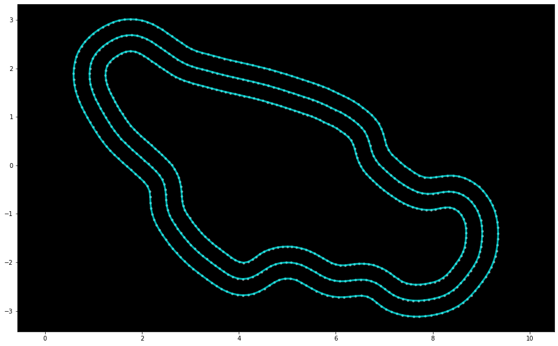
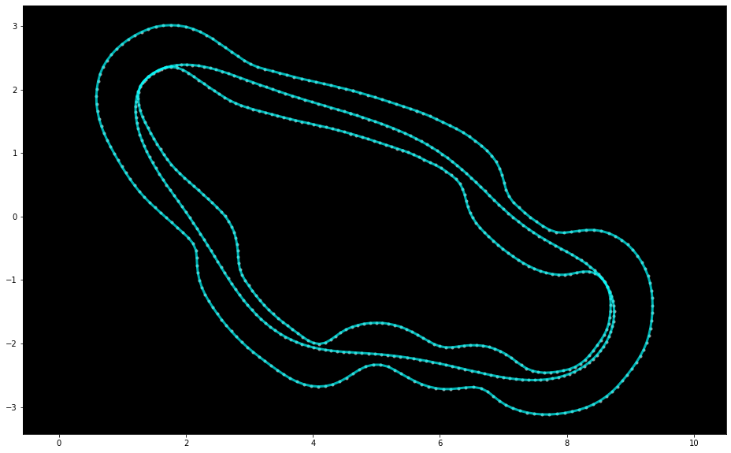
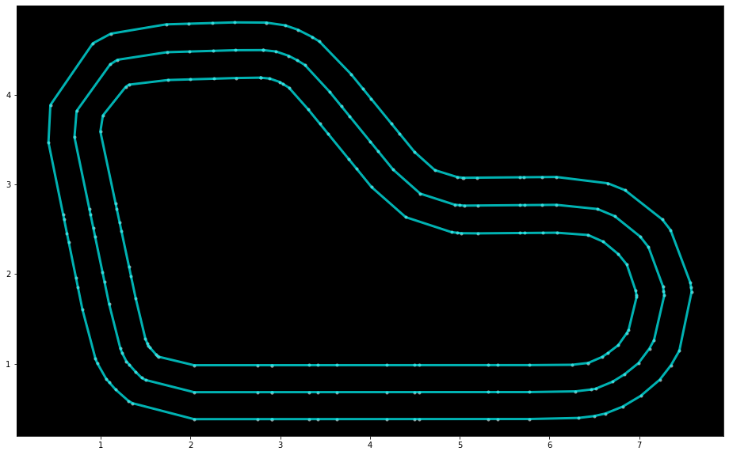
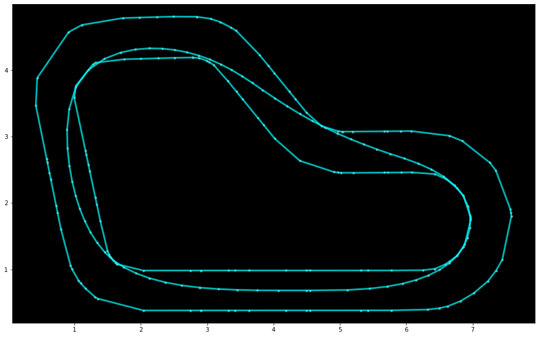
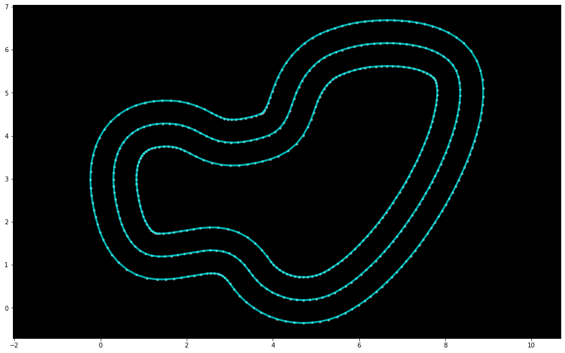
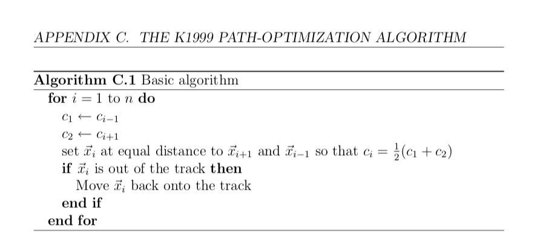

# Discovering Race Lines in DeepRacer Track Geometries

The [AWS DeepRacer Virtual Circuit](http://deepracerleague.com) is run every month and uses reinforcement learning to teach a car to successfully navigate a race track.  

Rewards functions are developed by each competitor in order to guide the learning, and these functions can vary widely.  One of the experiments I wanted to try was to be overly prescriptive to the car.  

## Source and Result

| Original Track | Calculated Race Line | Numpy coordinates |
|----------------|----------------------|-------------------|
|  |  | NumPy:&nbsp;[Canada_Training](racelines/Canada_Training-1000-4-2019-10-11-163418.npy) Python&nbsp;Code:&nbsp;[Canada_Training.py](racelines/Canada_Training-1000-4-2019-10-11-163418.py) |
|  |  | NumPy:&nbsp;[reinvent_base.npy](racelines/reinvent_base-400-4-2019-10-11-161903.npy) Python&nbsp;Code:&nbsp;[reinvent_base.py](racelines/reinvent_base-400-4-2019-10-11-161903.py) |
|  |  | NumPy:&nbsp;[reinvent2019.npy](racelines/reInvent2019_track-1000-4-2019-11-09-113228.npy) Python&nbsp;Code:&nbsp;[reinvent2019.py](racelines/reInvent2019_track-1000-4-2019-11-09-113228.py)

## Method

Borrowed directly from [Rémi Coulom's PhD Thesis](https://www.remi-coulom.fr/Thesis/):

> 

The code was hastily written but achieved a good enough result, so I stopped improving it.  One limitation is that the points along the race line will never migrate in the opposite direction of curvature, leaving some room for further straightening of the race line.
